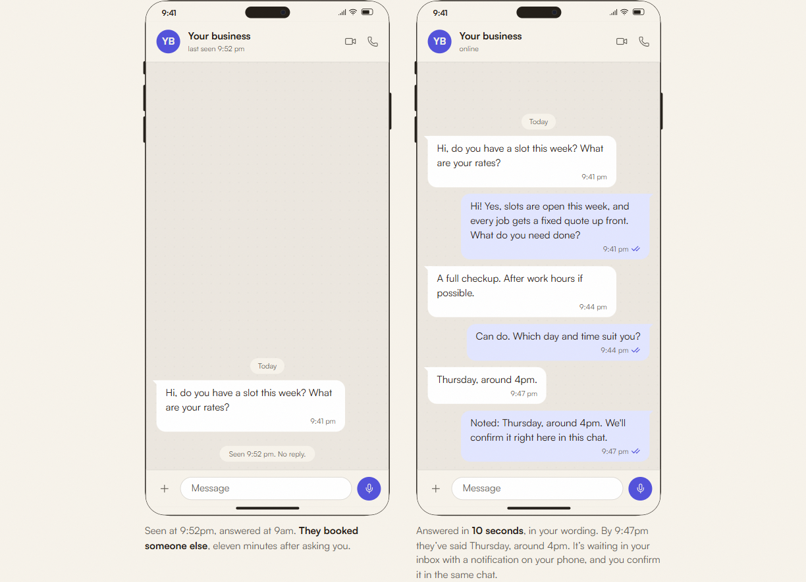
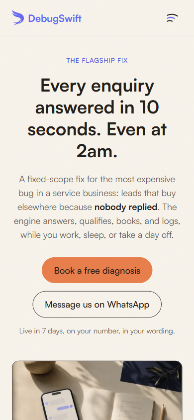

# Lead Engine

**Every enquiry answered in 10 seconds. Even at 2am.**

**Live:** https://debugswift.com/lead-engine

Lead Engine runs on a business's own WhatsApp Business number. It answers every enquiry straight away, asks the questions that tell you whether a lead is worth your time, and captures a booking or callback while the lead is still warm. Your team sees every conversation in one inbox, on phone and computer.

## What it does

- **Instant answer** to every enquiry in under 10 seconds, 24/7, in wording you approved
- **Qualifying flow:** 2 to 4 questions on what they need, when, and where
- **Booking or callback** at the customer's preferred day and time, for you to confirm
- **Nothing lost:** every conversation in your own team inbox, with an instant notification, exportable to a spreadsheet
- **One follow-up nudge** just inside 24 hours when a lead goes quiet. Not a drip campaign.
- **English, Bengali and Hindi,** in each language's own script, even when a customer types Bengali on an English keyboard

## What it never does

Each rule is checked in code before a reply is sent. A reply that breaks one is thrown away and a plainer approved line goes instead.

- Quote a price
- Invent proof
- Hide that it is automated: it says so in its first message, and a person is always one request away
- Link to a page that doesn't exist

**Your number stays yours:** the WhatsApp Business account is in your name, on your own Meta bill.

## Documentation

- **[How it works](docs/how-it-works.md):** scope, the rules, the 7-day setup, languages, handing over to a person, and when not to buy it
- **[Changelog](CHANGELOG.md):** what changed, and when

## Try it

Message DebugSwift on WhatsApp from [the Lead Engine page](https://debugswift.com/lead-engine) and start a timer. You'll get the same engine your customers would.

## Source code

Lead Engine's source is private. This repository is its public home: documentation, changelog and feature requests. Clients: please email hello@debugswift.com rather than opening a public issue, so your customers' details stay private.

Built by [DebugSwift](https://debugswift.com).
