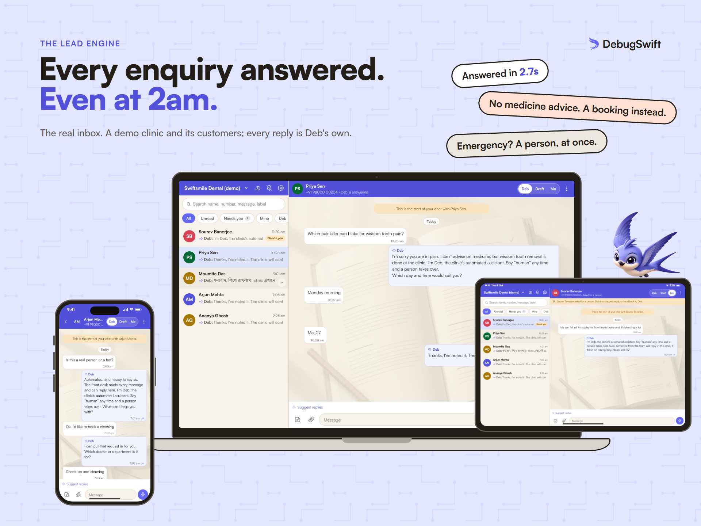

# How the Lead Engine works

The full page, with a live demo, is at [debugswift.com/lead-engine](https://debugswift.com/lead-engine). This is the same information in one place.

## The problem it fixes

The most expensive bug in a service business: leads that buy elsewhere because nobody replied. Say a customer messages at 9:41pm, you see it at 9:52pm, and you answer at 9am. They booked someone else, eleven minutes after asking you.

The Lead Engine answers, qualifies, books and logs every enquiry, while you work, sleep or take a day off.

## Five things, done properly

1. **Instant answer.** WhatsApp Business (or SMS or webchat where WhatsApp is weak) replies to every enquiry in under 10 seconds, 24/7, in wording you approved.
2. **Qualifying flow.** 2 to 4 questions: what they need, when, and where. Real prospects get through; tyre-kickers get a polite goodbye.
3. **Booking or callback.** Their preferred day and time, or your booking link, captured while the lead is still warm. You confirm.
4. **Nothing lost.** Every conversation in your own team inbox, on your phone and computer, with an instant notification. Export to a spreadsheet whenever you like.
5. **One follow-up nudge.** A quiet lead gets exactly one message, just inside 24 hours. Not a drip campaign.

## Small on purpose

| In scope | Out of scope (deliberately) |
|---|---|
| Instant replies on one channel, 24/7 | Website rebuilds |
| Qualifying questions in your wording | Ad campaigns |
| Booking link or callback capture | Multiple channels at once |
| Every lead in your team inbox, with a phone notification | A custom "AI personality" |
| One follow-up nudge, just inside 24 hours | Six-month roadmaps |
| A plain-language handover, everything in your name | Anything that stops it going live in 7 days |

## Four things it isn't allowed to do

These aren't instructions we hope it follows. Each is checked in code after a reply is written and before it's sent. Break one and the reply is thrown away, and a plainer approved line goes instead.

1. **Quote a price.** Not a number, not a range, not "starting from". Price follows a diagnosis and a conversation with you.
2. **Invent proof.** No client counts, case studies, percentages or star ratings.
3. **Hide what it is.** It says it's automated in its first message and names the way to reach a person in the same breath.
4. **Send customers somewhere that doesn't exist.** It may only link to pages that are actually on your site.

## Languages

English, Bengali or Hindi, whichever your customer writes in, always in that language's own script. Someone typing Bengali on an English keyboard still gets a proper Bengali reply. Anything else gets a careful English answer rather than a guess, because the rules above are enforced in the languages that have been checked.

## When a person takes over

Your customer asks for a person, typed or tapped, and the assistant stops for that conversation until it's handed back. Your team is notified straight away and replies in the same thread, from the same number.

If the AI fails mid-conversation, your customer still gets a complete, sensible sentence: a plainer version of the same question. They never see an error.

## The week it takes

| Day | |
|---|---|
| 1 | **Kickoff.** We map your enquiries: the questions customers ask, the answers you give, what makes a lead worth your time. |
| 2 to 3 | **Build.** The flow is written in your wording (greeting, questions, booking, polite goodbye) on your WhatsApp Business account. |
| 4 to 5 | **Wiring.** Your number connected, the team inbox on your phone with notifications on, Deb's facts and safety rules set. Tested against your real past conversations. For the first days Deb drafts and you approve. |
| 6 | **Your turn.** You try to break it. Anything that sounds off is rewritten the same day. |
| 7 | **Live.** Real enquiries, real bookings, and a one-page handover: what it does, what it never does, who to call. |

## Your number stays yours

Your WhatsApp Business account and number are in your name, on your own Meta bill. The wording is yours: you approved it line by line. If we part ways, your number and account stay with you and you can export every conversation. Switching it off is one setting.

**Cost:** a one-off setup fee, then one monthly plan covering the inbox, the assistant and the AI. WhatsApp's own message charges go on your own Meta bill, never through us. Both figures are fixed on the diagnosis call, in writing.

## When you shouldn't buy this

- **You barely get enquiries.** Then your problem is being found, not replying. That's SEO or ads, and we'll say so.
- **Your leads only phone.** The engine answers messages.
- **You already answer within a minute, always.** Then there's no leak.
- **You want a do-everything AI.** That's a real project we build, but not this product.

## Try it

Message DebugSwift on WhatsApp from [debugswift.com/lead-engine](https://debugswift.com/lead-engine) and start a timer. The reply you get is the same engine your customers would get.
